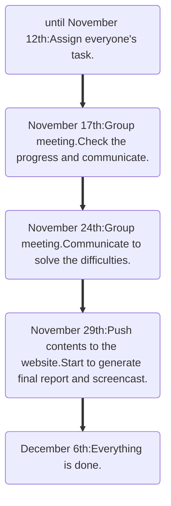

```{r setup, include=FALSE}
knitr::opts_chunk$set(echo = TRUE)
library(tidyverse)
```

## The group members

```{r, echo = FALSE}
group_member =
  tibble(
    name = c("Shaoyu Chen", "Xiangxiong Feng", "Haitian Huang", "Yunshen Bai", "Kindle Zhang"),
    uni = c("sc5351", "xf2270", "hh3043", "yb2584", "qz2527")
  ) |>
  knitr::kable()

group_member
```

## The tentative project title

Preliminary Exploration of Regional Differences and Influencing Factors in Government Corruption Index

## The motivation for this project

“We hang the petty thieves and appoint the great ones to public office.” - Aesop

The Corruption Perceptions Index (CPI) measures the perceived levels of government corruption in different countries. 

The government corruption index seems very far away from us, but as socially concerned students, we want to explore some of the subtle and deep factors behind the index and the reasons for regional differences. And by visualizing the results to deepen the understanding of the index for people who see the report.

## The intended final products

The final project will cover following  
**Data**:  
-	Description of data and variables  
-	Data cleaning and manipulation  

**Data Visualization**:  
-	Use a variety of graphs and tables to present our findings.  
- Perform exploratory data analysis.   
- box plots and histograms  
-	A map of the world corruption levels  

**Analysis**:  
-	Figure out factors related to corruption index  
-	Statistical analyses such as several kinds of hypothesis tests.  

**Regression Model**:  
-	Build a basic regression model  
-	Model improvement, model diagnostics and predictions  


## The anticipated data sources

https://databank.worldbank.org/source/worldwide-governance-indicators

https://ourworldindata.org/

https://www.kaggle.com/datasets/

https://github.com/

https://osf.io/

https://data.gov/

https://data.world/datasets/corruption


## The planned analyses / visualizations / coding challenges

<<<<<<< HEAD
## The planned timeline

=======
Analyses：
We will try to figure out factors related to corruption index. We will model the relationship between corruption index and some variables within countries year by year. 
These variables include government effectiveness, voice and accountability, economy stats such as GDP per capita, development indicators such as education, etc. Corruption index will also be analyzed by continents. 
We might also do a cluster analysis to classify countries. We will build models through linear regression, and use cross-validation to choose the best one.

Visualization:
In this part, we will use several different types of graphs and tables to illustrate our results and present exploratory data analysis. 
Histograms and boxplots will be used to show arranged estimated control of corruption of each region from different years. 
The tendency for each key variable will be presented by correlation and scatter plots. Furthermore, the linear plots for each regression model will be created to clarify the correlation between different variables and the estimated control of corruption.

Coding Challenges:
There are some expected coding challenges. In the regression section, there might be some difficulties to code modeling and the validation method such as cross-validation.
Furthermore, there will also be expected difficulties in setting up the website. We might need to learn some new html elements and shiny app function.

## Time table


>>>>>>> a98e0d7fe821833fe9335b8aa650bced94e9d352
