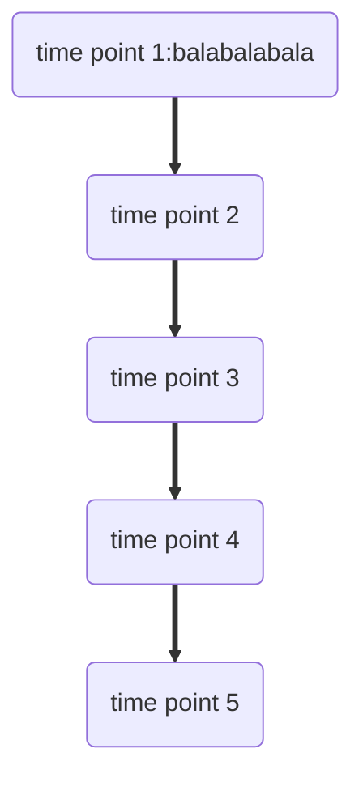

```{r setup, include=FALSE}
knitr::opts_chunk$set(echo = TRUE)
library(tidyverse)
```

## The group members

```{r, echo = FALSE}
group_member =
  tibble(
    name = c("Shaoyu Chen", "Xiangxiong Feng", "Haitian Huang", "Yunshen Bai", "Kindle Zhang"),
    uni = c("sc5351", "xf2270", "hh3043", "yb2584", "qz2527")
  ) |>
  knitr::kable()

group_member
```

## The tentative project title

Preliminary Exploration of Regional Differences and Influencing Factors in Government Corruption Index

## The motivation for this project

“We hang the petty thieves and appoint the great ones to public office.” - Aesop

The Corruption Perceptions Index (CPI) measures the perceived levels of government corruption in different countries. 

The government corruption index seems very far away from us, but as socially concerned students, we want to explore some of the subtle and deep factors behind the index and the reasons for regional differences. And by visualizing the results to deepen the understanding of the index for people who see the report.

## The intended final products

## The anticipated data sources

## The planned analyses / visualizations / coding challenges

Analyses：
We will try to figure out factors related to corruption index. We will model the relationship between corruption index and some variables within countries year by year. These variables include government effectiveness, voice and accountability, economy stats such as GDP per capita, development indicators such as education, etc. Corruption index will also be analyzed by continents. We might also do a cluster analysis to classify countries. We will build models through linear regression, and use cross-validation to choose the best one.

Coding Challenges:
There are some expected coding challenges. In the regression section, there might be some difficulties to code modeling and the validation method such as cross-validation. 

## Time table

